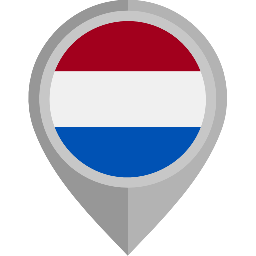
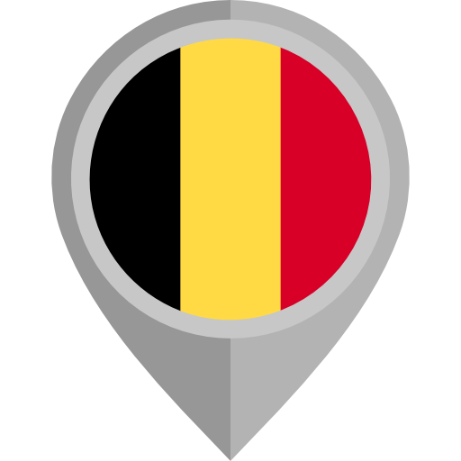
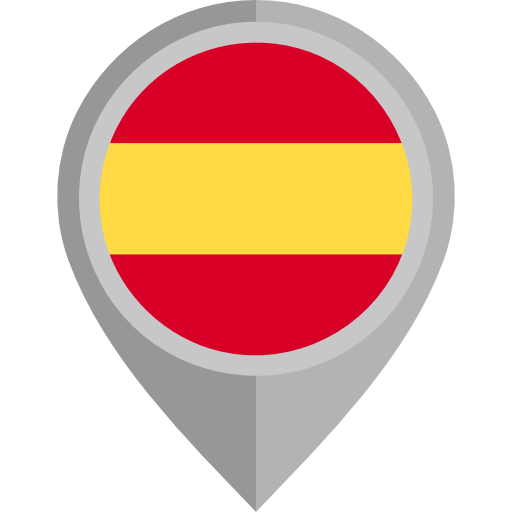

```{r setup, include=FALSE}
knitr::opts_chunk$set(echo = FALSE)
library(leaflet)
```
## Busiest container ports in Europe 2018 
Eva Wesolowska <br>
April 7, 2021
```{r, echo=FALSE, warning=FALSE, message=FALSE}

PortSites <- c(
 "<a href='https://en.wikipedia.org/wiki/Port_of_Rotterdam'>Port Of Rotterdam</a>",
 "<a href='https://en.wikipedia.org/wiki/Port_of_Antwerp'>Port Of Antwerp</a>",
 "<a href='https://en.wikipedia.org/wiki/Port_of_Hamburg'>Port Of Hamburg</a>",
 "<a href='https://en.wikipedia.org/wiki/Ports_of_Bremen'>Port Of Bremen</a>",
 "<a href='https://en.wikipedia.org/wiki/Port_of_Valencia'>Port Of Valencia</a>",
 "<a href='https://en.wikipedia.org/wiki/Port_of_Piraeus'>Port Of Piraeus</a>",
 "<a href='https://en.wikipedia.org/wiki/Port_of_Algeciras'>Port Of Algeciras</a>",
 "<a href='https://en.wikipedia.org/wiki/Port_of_Gioia_Tauro'>Port Of Gioia Tauro</a>",
 "<a href='https://en.wikipedia.org/wiki/Port_of_Felixstowe'>Port Of Felixstowe</a>",
 "<a href='https://en.wikipedia.org/wiki/Port_of_Barcelona'>Port Of Barcelona</a>")

md_ports <- data.frame(name = c("Rotterdam", "Antwerp", "Hamburg", "Bremen-Bremerhaven",  "Valencia", "Piraeus", "Algeciras", "Gioia Tauro", "Felixstowe", "Barcelona"),
                      pop = c(13598, 10830, 8741, 5442, 5169, 4910, 4773, 4005, 3781,3442),
                      lat = c(51.885, 51.27, 53.546111, 53.57, 39.4457, 37.941944, 36.136, 38.433333, 51.954171, 41.3375),
                      lng = c(4.2867, 4.336667, 9.966111, 8.544, -0.3199, 23.636111, -5.435, 15.9, 1.310158, 2.152222)
                       )

md_ports %>%
  leaflet() %>%
  addTiles() %>%
  setView( lng = 23, lat = 54, zoom = 3.17) %>%
  addCircles(weight = 1, radius = sqrt(md_ports$pop) * 1000, popup = PortSites, color = "red")
  
```
<I><font size=1>Icons made by <a href="https://www.freepik.com" title="Freepik">Freepik</a> from <a href="https://www.flaticon.com/" title="Flaticon">www.flaticon.com. </a></I></font>
 <font size=1> Source: <a href="https://en.wikipedia.org/wiki/List_of_busiest_ports_in_Europe"><I>Wikipedia</I></font></a>

